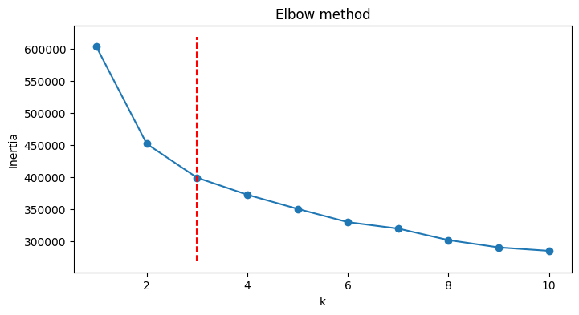
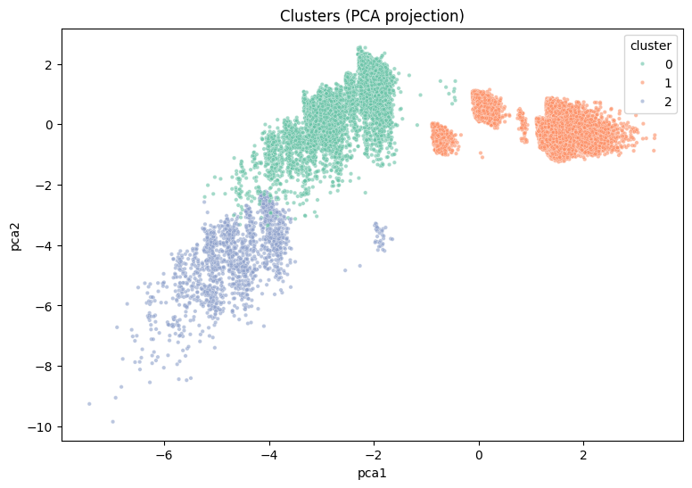

# Unsupervised-Customer-Segmentation-for-Bank-Term-Deposit-Marketing

## Project Overview

This project utilizes unsupervised machine learning techniques—specifically K-Means clustering combined with Principal Component Analysis (PCA)—to perform customer segmentation on the Bank Marketing dataset from a Portuguese banking institution. The primary objective is to discover natural, actionable client segments to optimize future telemarketing campaigns, thereby enhancing efficiency and maximizing term deposit subscription rates.

The analysis successfully segmented the customer base into three distinct profiles driven by behavioral and prevailing macroeconomic factors.

## Methodology and Key Results

### 1. Data Processing and Modeling

The analysis employed the `bank-additional-full.csv` [link to a file source](https://archive.ics.uci.edu/dataset/222/bank+marketing) dataset, covering marketing results from May 2008 to November 2010. 

1.  **Preprocessing:** Categorical features were processed using One-Hot Encoding (OHE), and all numerical features were scaled to ensure robust distance-based calculations.
2.  **Dimensionality Reduction (PCA):** PCA was applied to reduce the dimensionality, projecting the feature space onto two principal components (PCA1 and PCA2) to enable effective visual confirmation.
3.  **Optimal Clustering (K-Means):** The optimal solution was determined to be $k=3$ using the Elbow Method (see Visualizations below). K-Means was implemented to segment the data into three distinct groups.

### 2. Core Findings: The Three Customer Archetypes

The three generated clusters are primarily differentiated by the client's campaign engagement history (`pdays`, `previous`) and the prevailing economic conditions at the time of contact:

| Cluster | Archetype | Key Characteristics (Based on Feature Averages) | Strategic Recommendation |
|---|---|---|---|
| **Cluster 2 (Active)** | **The Engaged Warm Leads** | **Highest Activity:** Lowest mean `pdays` and highest `previous` contacts (1.69), indicating recent and successful past engagement. **Context:** Correlated with negative scaled macroeconomic indices (low `euribor3m`, `nr.employed`), suggesting high responsiveness during economic uncertainty. | **Prioritize:** Focus retention and personalized premium offers, timing outreach during periods of low interest rates/employment fluctuations. |
| **Cluster 1 (Dormant/High Effort)** | **High-Effort Dormant** | **Dormant History:** High `pdays` (999—no prior contact). **High Cost:** Highest average `campaign` contacts (2.80) in the current cycle, suggesting low efficiency. **Context:** Approached during the most stable economic periods (highest mean `nr.employed`). | **Re-evaluate:** Minimize expensive telemarketing efforts. Shift budget towards low-cost, automated digital channels for engagement testing. |
| **Cluster 0 (Dormant/Low Effort)** | **Virgin Low-Effort Market** | **Dormant History:** High `pdays` (999). **Efficient Target:** Lowest average `campaign` contacts required (2.12), offering the best potential ROI among dormant clients. | **Efficient Acquisition:** Ideal for initial, scalable marketing campaigns due to required low contact frequency and clean prior history. |

## 3. Visualizations

The images below provide visual validation for the clustering solution.

### 3.1 Optimal Cluster Selection: Elbow Method

The plot shows the sharp decrease in inertia beginning to level off at $k=3$, justifying its selection.

### 3.2 Cluster Separation in Reduced Space

The scatter plot projects the multi-dimensional data onto the two main components (PCA1 and PCA2), showing clear, robust separation between the three generated clusters.

### 3.3 Cluster Profiling: Feature Averages (Scaled)

This heatmap displays the standardized average value of each numerical feature within each cluster, highlighting the extreme differentiation driven by `pdays`, `previous`, and macroeconomic factors in Cluster 2.

.png)

.png)

## 4. Technical Requirements

The project notebook relies on fundamental Python libraries for data science and machine learning:

| Library | Function |
|---|---|
| `pandas` | Data manipulation and import |
| `numpy` | Numerical operations |
| `scikit-learn` | Implementing K-Means clustering and PCA |
| `matplotlib` | General plotting (e.g., histograms, elbow plot) |
| `seaborn` | Advanced statistical visualizations (e.g., heatmaps, scatter plot) |
| `kneed` | Objective detection of the optimal knee point for determining $k$ in the Elbow Method |

---
**How to Run:**
1. Clone the repository.
2. **Important:** Create an `images/` directory and save your plot images inside it using the filenames: `Image 5.png`, `Image 3.png`, and `Image 2.png`.
3. Install dependencies: `pip install pandas numpy scikit-learn matplotlib seaborn kneed`
4. Run the Jupyter notebook: `customer_segmentation.ipynb`
